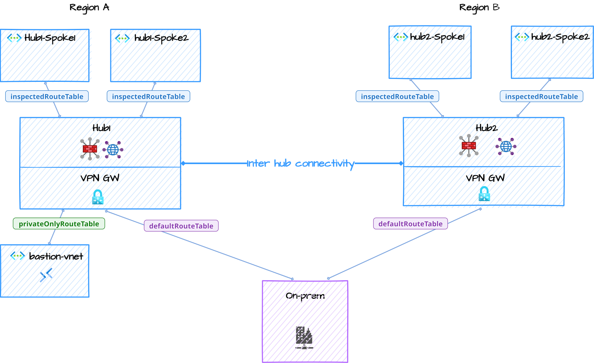

# Azure vWAN Secure Hub Route Tables Lab

> This lab script is based on work by Daniel Mauser (see *Credits & Source* below).

This repo contains a **Bicep-based deployment** for a two-hub **Virtual WAN** lab with spokes, a branch VNet, VPN gateways, secured hub Azure Firewalls, Log Analytics, and Azure Bastion. Traffic is configured with explicit virtual hub route tables and connection associations.

> **No routing intent resources are deployed.** References to routing intent below apply only to migration protection, documented platform limitations, and credit for the original lab.

## Routing Design

The deployment creates these custom virtual hub route tables:

| Hub | Custom route table | Static routes | Next hop |
|---|---|---|---|
| Hub 1 | `inspectedRouteTable` | RFC 1918 prefixes and `0.0.0.0/0` | Hub 1 Azure Firewall |
| Hub 1 | `privateOnlyRouteTable` | RFC 1918 prefixes only | Hub 1 Azure Firewall |
| Hub 2 | `inspectedRouteTable` | RFC 1918 prefixes and `0.0.0.0/0` | Hub 2 Azure Firewall |

Both hubs also use their Azure-provided `defaultRouteTable`; the template references these built-in tables rather than creating them.

| Connection | Associated route table | Propagates to | Internet security |
|---|---|---|---|
| Spoke 1 VNets | `inspectedRouteTable` | `defaultRouteTable` | Enabled |
| Spoke 2 VNets | `defaultRouteTable` | `defaultRouteTable` | Enabled |
| Branch VPN | `defaultRouteTable` | `defaultRouteTable` | Enabled |
| Bastion VNet | `privateOnlyRouteTable` in Hub 1 | `defaultRouteTable` | Disabled |

Azure requires branch VPN connections to associate with the built-in `defaultRouteTable`; custom route-table association is supported for VNet connections but not branches. Spoke 2 in each hub also associates with `defaultRouteTable`, so traffic originating there follows learned private routes directly instead of the RFC 1918 static routes through Azure Firewall. Internet security remains enabled on those connections. This is symmetric for peers that also use `defaultRouteTable`; Spoke 2-to-Spoke 1 flows can still be asymmetric because Spoke 1 returns private traffic through `inspectedRouteTable`. The Bastion-specific table sends private traffic through Hub 1 Azure Firewall but has no `0.0.0.0/0` route. This preserves Bastion's required direct control-plane internet access. Connected VNet and VPN prefixes propagate to the built-in default route tables.

In practical terms, private traffic from either Spoke 2 to the branch/on-premises network bypasses Azure Firewall in both hubs. In the validated deployment, `enableInternetSecurity` alone did not steer Spoke 2 internet egress through Azure Firewall while those connections were associated with `defaultRouteTable`; their observed public egress addresses differed from the hub firewall addresses. Spoke 1 private and internet traffic uses `inspectedRouteTable` and traverses the local hub firewall.

This explicit route-table design has an important boundary: it does not provide symmetric Azure Firewall inspection for branch-initiated or inter-hub private traffic involving Spoke 1. Branch traffic enters through `defaultRouteTable`, while Spoke 1 return traffic uses `inspectedRouteTable`; the resulting asymmetric path is dropped by the stateful firewall. Microsoft documents routing intent as the only supported mechanism for inter-hub inspection through security appliances. Use the [upstream routing-intent design](https://github.com/dmauser/azure-virtualwan/tree/main/svh-ri-intra-region) when those flows are required.

## Architecture



## Prerequisites

### Requirements

- **PowerShell 7+** — Run the deployment script with `pwsh`. Windows PowerShell 5.1 is not supported.
- **Azure Subscription** — An active Azure subscription with sufficient quota for the resources deployed
- **RBAC role at subscription scope** — **Contributor** is sufficient; **Owner** also works. Resource-group-only access is not sufficient because the subscription-scoped template creates the resource group.
- **Azure CLI with Bicep support** — The deployment script invokes `az deployment sub create`
- **Azure CLI Virtual WAN extension** — The migration guard checks for routing intent left by an earlier version using the preview `az network vhub routing-intent list` command:
  ```powershell
  az extension add --name virtual-wan --upgrade
  ```
- Logged in to Azure CLI. When deploying to another tenant, specify its tenant ID or verified domain during login:
  ```powershell
  az login --tenant "<TENANT_ID_OR_DOMAIN>"
  ```

### Required Resource Providers

The subscription must have these resource providers registered:

- `Microsoft.Network`
- `Microsoft.Compute`
- `Microsoft.OperationalInsights`
- `Microsoft.Insights`

Each virtual hub uses a `/22` address space, the minimum size required for Azure Firewall in Virtual WAN. Virtual hub address prefixes can't be changed after creation, so an older deployment with `/24` hubs must be deleted and recreated.

## Getting Started

### Clone the Repository

```powershell
git clone https://github.com/colinweiner111/azure-vwan-secure-hub-route-tables-lab.git
cd azure-vwan-secure-hub-route-tables-lab
```

## Deployment

Use the PowerShell deployment script:

```powershell
.\deploy-bicep.ps1 -SubscriptionId <subscription-id> -ResourceGroupName <your-rg-name> -Location westus3 -Location2 centralus
```

Example:
```powershell
.\deploy-bicep.ps1 -SubscriptionId 00000000-0000-0000-0000-000000000000 -ResourceGroupName vwan-lab-rg -Location westus3 -Location2 centralus
```

The script will:
1. Select and verify the exact subscription supplied with `-SubscriptionId`
2. If the target resource group already exists, check it for routing intent left by the original design
3. Deploy the subscription-scoped Bicep template, which creates the resource group
4. Prompt securely for the VM admin password and VPN pre-shared key if not provided

> **Use a fresh resource group when migrating from the original lab.** Azure Resource Manager deployments are incremental and do not delete its routing intent resources. The deployment script refuses to continue if it finds one. This route-table version itself does not create routing intent.

### Required Parameter

- `-SubscriptionId`: Azure subscription GUID to select, verify, and use for all resource checks and deployment operations

### Optional Parameters

- `-ResourceGroupName`: Resource group name (default: `vwan-route-tables-lab`)
- `-Location`: Hub 1, branch, and Bastion region (default: `westus3`)
- `-Location2`: Hub 2 region: `westus3`, `centralus`, `westcentralus`, or `southcentralus` (default: `westus3`)
- `-AdminUsername`: VM administrator username (default: `azureuser`)
- `-VmSize`: VM SKU for all five Linux VMs (default: `Standard_D2ls_v7`); override this when regional capacity requires another SKU
- `-AdminPassword`: VM administrator password as a `SecureString`
- `-VpnSharedKey`: VPN pre-shared key as a `SecureString`
- `-FirewallSku`: `Standard` or `Premium` (default: `Premium`)

For non-interactive use, construct the secure parameters before invoking the script:

```powershell
$adminPassword = ConvertTo-SecureString $env:AZURE_VM_ADMIN_PASSWORD -AsPlainText -Force
$vpnSharedKey = ConvertTo-SecureString $env:AZURE_VPN_SHARED_KEY -AsPlainText -Force
./deploy-bicep.ps1 -SubscriptionId <subscription-id> -AdminPassword $adminPassword -VpnSharedKey $vpnSharedKey
```

## What Gets Deployed

- vWAN + two vHubs
- Two spokes per hub
- Branch site with VPN Gateway (BGP)
- Azure Firewall (Hub) + Policy per hub
- Log Analytics Workspaces + diagnostic settings
- Two custom `inspectedRouteTable` route tables, one Hub 1 `privateOnlyRouteTable`, and explicit connection associations and propagations
- **Azure Bastion — provides browser-based RDP/SSH access to all VMs (both hubs and branch)**
- **5 Ubuntu VMs:**
  - branch1-vm (in branch VNet)
  - hub1-spoke1-vm, hub1-spoke2-vm (in Hub 1 spokes)
  - hub2-spoke1-vm, hub2-spoke2-vm (in Hub 2 spokes)

## Default Configuration

- **Username**: `azureuser`
- **Password**: Prompted during deployment (set a strong password)
- **Regions**: Both hubs in `westus3` by default. Cross-region Hub 2 placement is optional and has not been validated end to end.
- **VM Size**: `Standard_D2ls_v7`
- **Firewall SKU**: Premium by default
- **VPN pre-shared key**: Prompted during deployment

## VM Network Information

| VM Name | VNet | Subnet Range |
|---------|------|--------------|
| branch1-vm | branch1 | 10.100.0.0/24 |
| hub1-spoke1-vm | hub1-spoke1 | 172.16.1.0/27 |
| hub1-spoke2-vm | hub1-spoke2 | 172.16.2.0/27 |
| hub2-spoke1-vm | hub2-spoke1 | 172.16.3.0/27 |
| hub2-spoke2-vm | hub2-spoke2 | 172.16.4.0/27 |

*VMs receive dynamic IPs within their respective subnets*

## Accessing VMs via Azure Bastion

Azure Bastion provides browser-based SSH access to the lab's Ubuntu VMs without assigning public IPs to those VMs.

In this lab, the Hub 1 private-only route table sends Bastion-to-VM traffic through Azure Firewall. The standard Bastion "Connect to VM" flow assumes direct VNet peering, so use an IP-based connection.

As a result, Bastion must use **"Connect via IP address"**, explicitly targeting the VM's private IP so traffic can traverse the vWAN routing fabric and firewall as intended.

> **Important:** The Bastion connection is associated with `privateOnlyRouteTable` and has `enableInternetSecurity` disabled. Do not add a default route to that table; doing so can break Bastion control-plane connectivity.
>
> See: [Azure Bastion FAQ — Virtual WAN](https://learn.microsoft.com/azure/bastion/bastion-faq#vwan)

> **Lab-only firewall policy:** The deployed `AnytoAny` network rule already permits SSH, RDP, and all other traffic. Replace it with least-privilege rules before adapting this lab for a production environment.

> **References:**
> - [Connect to a VM via IP address (Microsoft Docs)](https://learn.microsoft.com/azure/bastion/connect-ip-address) — Official guide for using Bastion's IP-based connection feature (requires Standard SKU)
> - [Azure Bastion Routing in Virtual WAN (Jose Moreno)](https://blog.cloudtrooper.net/2022/09/17/azure-bastion-routing-in-virtual-wan/) — Deep dive into Bastion placement options and routing behavior in vWAN topologies

### Using Azure Portal (IP-based connection)
1. Navigate to **Azure Portal → Bastions**
2. Select **SharedBastion**
3. Under **Connect**, select **Connection Settings**
4. Choose **Connect via IP address**
5. Enter the **private IP address** of the target VM (see [VM Network Information](#vm-network-information) or check the VM's network interface)
6. Enter username: `azureuser`
7. Enter the password you set during deployment
8. Click **Connect**

> 💡 **Tip:** Bastion Standard SKU is required for IP-based connections. This lab deploys Standard by default.

## Cleanup

When finished, delete the resource group:
```powershell
az group delete --subscription <subscription-id> --name <your-rg> --yes --no-wait
```

## Validation

The West US 3 deployment was tested with ICMP and TCP/22 for private paths, plus DNS and public-IP checks for internet egress.

| Flow | Result | Notes |
|---|---|---|
| Spoke 1 to private destinations | Route configured | RFC 1918 routes use the local Azure Firewall through `inspectedRouteTable` |
| Spoke 2 to branch/on-premises | Route configured | Learned private routes use `defaultRouteTable` and bypass Azure Firewall in both hubs |
| Spoke 2 internet egress | Direct internet access observed | `enableInternetSecurity` is enabled, but the validated deployment did not steer this traffic through Azure Firewall while associated with `defaultRouteTable` |
| Spoke 2 to Spoke 1 | Asymmetric | Spoke 2 originates through `defaultRouteTable`; Spoke 1 returns through `inspectedRouteTable` |
| Branch to Spoke 1 | Fail | Asymmetric `defaultRouteTable` and inspected-table paths |
| Cross-hub inspected traffic | Unsupported | Explicit custom routes do not provide supported inter-hub firewall inspection |
| Branch internet egress | Pass | DNS and HTTPS egress succeeded |

For comparison, see [Virtual WAN routing policies](https://learn.microsoft.com/azure/virtual-wan/how-to-routing-policies) for the routing-intent design used for symmetric branch and inter-hub inspection. That feature is not deployed by this lab.

## Credits & Source

This implementation is adapted from Daniel Mauser's [Secured Virtual Hubs and Routing Intent lab](https://github.com/dmauser/azure-virtualwan/tree/main/svh-ri-intra-region).

Huge thanks to **Daniel Mauser** ([@dmauser](https://github.com/dmauser)) and **Jose Moreno** ([@erjosito](https://github.com/erjosito)) for sharing and maintaining these scenarios and guidance.

---

© MIT Licensed. See `LICENSE`.


